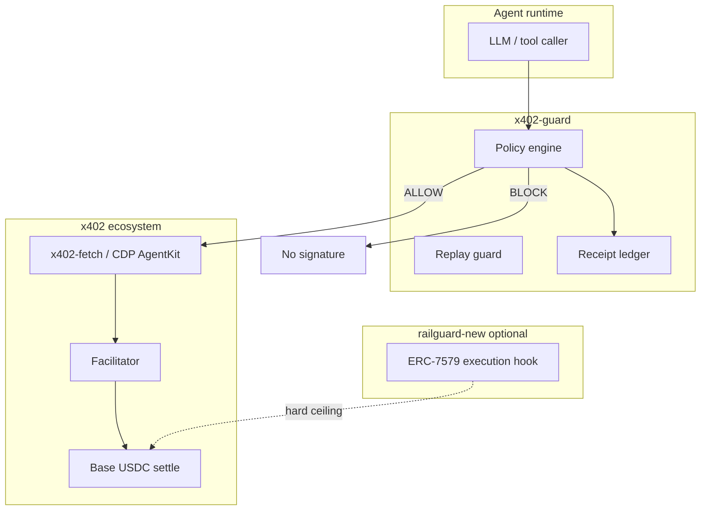

# Architecture

## Layered stack

## Package boundaries

### `@x402-guard/core`

Types: `X402PaymentContext`, `AgentPolicyConfig`, `PolicyDecision`, URL parsing, stable JSON.

### `@x402-guard/policy`

- `SpendTracker` — rolling window aggregates per agent
- `ReplayGuard` — TTL fingerprint dedup
- `evaluateAgentPolicy()` — deterministic allow / block / escalate

Ideas ported from `railguard-new/policy/railguard.rego` and `coinbase/packages/policy`.

### `@x402-guard/receipts`

`ReceiptLedger` — hash-chained audit entries. Extends `railguard-new/docs/RECEIPT_SCHEMA.md` and `coinbase/packages/audit`.

### `@x402-guard/middleware`

- `X402Guard` — orchestrates policy + replay + receipts
- `withSpendingPolicy()` — wraps `PaymentCallback` (x402-go #26 pattern)

### `middleware-go`

Go port for upstream PR to [mark3labs/x402-go](https://github.com/mark3labs/x402-go).

## Policy decisions

| Decision | Meaning | x402 proceeds? |
|----------|---------|----------------|
| `allow` | Within all rules | Yes |
| `block` | Hard deny | No |
| `escalate` | Needs human / mandate | No unless `onEscalate` approves |

## Sibling integration

**railguard-new** — intent `resource.domain` maps to x402 URLs; optional hook rejects bypass.

**coinbase** — `packages/policy` stays invoice-focused; autonomous track imports `@x402-guard/middleware` before CDP execution.

## Threat model (v0.1)

| Threat | Mitigation |
|--------|------------|
| Rogue agent overspend | Per-call + window caps |
| Retry storm | ReplayGuard fingerprint |
| Malicious domain | Domain blocklist / allowlist |
| Unknown merchant | Payee allowlist |
| High-value without mandate | Escalate |
| No audit trail | Receipt on every attempt |
